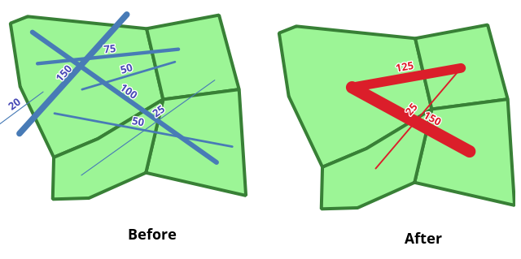

# Miscellaneous-GIS-Scripts
Contains python scripts to perform various tasks. Some are written as processing scripts, others are meant to be loaded for use in Expressions (e.g. for use with the Field Calculator), and others are meant to simply be run from the python window in QGIS.

## Aggregate OD Lines
Aggregates Origin-Destination pair lines into groups based on user-supplied polygonal areas. QGIS 3 processing script.

### Parameters
* OD Line Layer: Layer containing the origin-destination pair lines.
* Flow Field: Field in the line layer which contains the magnitude of the flows.
* Aggregation Zones Layer: Polygon layer containing the zones into which to aggregate the flows.
* Zone Name Field: Field in the zone layer containing a unique name for each zone. This is used to populate the "from" and "to" fields in the output.
* Discard Internal Trips: If checked, trips starting and ending in the same zone will be excluded from the output. If unchecked, these will be included in the output. Warning: these trips will be output as lines whose start and end points are the same.

## Find Minimum Distance
Processing script which returns the minimum distance between two points in a point layer. Versions for both QGIS 2 and 3.

## Average of Multipoint
For use in expressions. Returns the average point / centroid of a multipoint geometry.

## Match German Abbreviations
For use in expressions. Evaluates if two strings match, taking common German abbreviations for place names and transportation points into account.

## Number Selected Features
Numbers the selected features in the active layer with an increasing index in the specified field.

## Number Selected Features Group By Field
Numbers each group of the selected features in the active layer which have matching group field values with an increasing index in the specified field.
